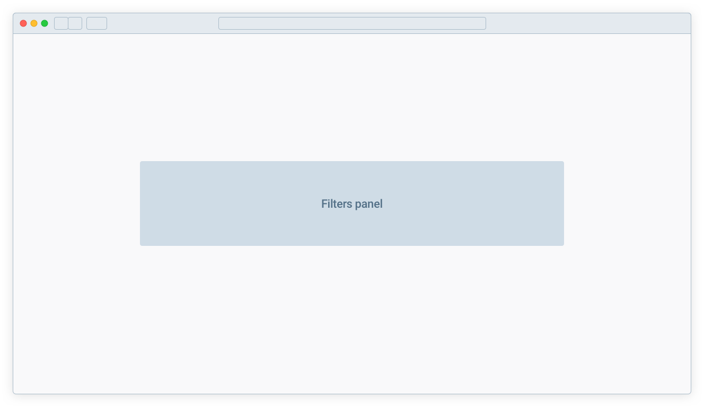
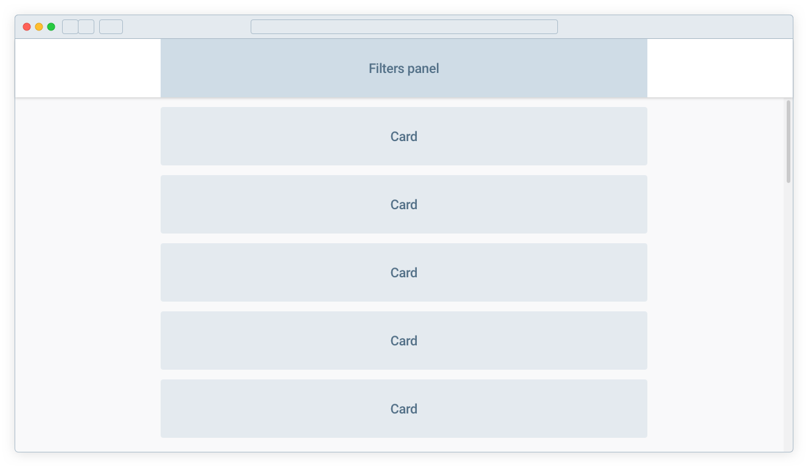
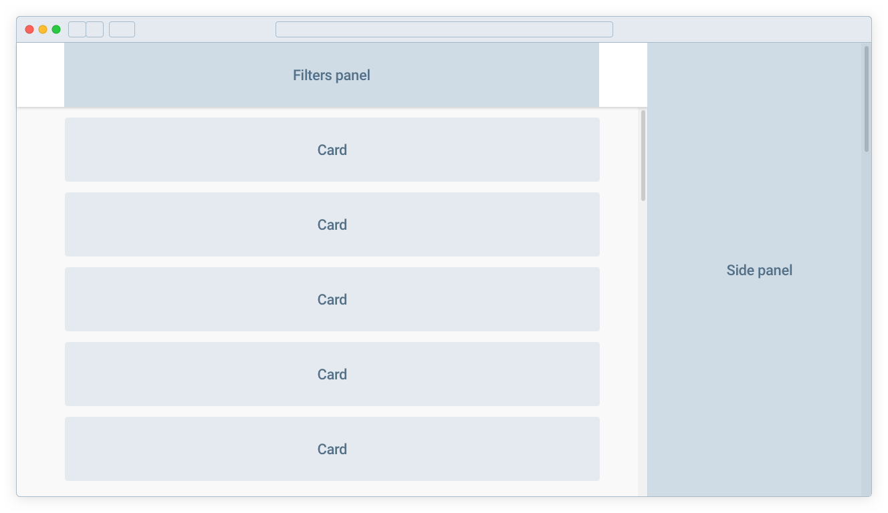

## Тестовое задание

Часто встречающийся кейс в проектах — страница выдачи большого массива данных с возможностью их фильтрации и просмотра подробной информации по каждому объекту. 

В данном задании предлагается воспроизвести подобную функциональность с использованием открытого API [TheMovieDB](https://developer.themoviedb.org/reference/getting-started). 
Для получения токена необходимо [зарегистрироваться](https://www.themoviedb.org/account/signup) и следовать [инструкциям](https://developers.themoviedb.org/3/getting-started/introduction) во вступительном разделе документации.

### Условия

* Использовать монорепо
* Использовать React
* Использовать NestJS
* можно использовать любую библиотеку готовых компонентов и вообще любые библиотеки

### Задача

Реализовать двухстраничное приложение для получения списка фильмов с возможностью поиска и фильтрации.

Первая страница содержит только панель фильтров:

Вторая страница состоит из

* фиксированной шапки с фильтрами
* результатов поиска — списка карточек с краткой информацией о фильме
* боковой панели для просмотра полной информации

Минимальная ширина экрана — 1280px, максимальная ширина колонки фильтров/выдачи — 1440px.  Mockup'ы иллюстрируют взаимное расположение элементов и их цветовая гамма ни к чему не обязывает)

##### Панель поиска/фильтрации

включает в себя:

* поиск по названию фильма
* фильтр по жанру
* фильтр по рейтингу
* фильтр по году
* кнопку, по которой осуществляется поиск (а на первой странице еще и переход ко второй)

##### Результаты поиска

* фильмы загружаются с сортировкой по дате релиза от новых к старым, от текущей даты
* фид бесконечно подгружается по прокрутке
* карточка фильма содержит
	* название
	* описание
	* рейтинг
	* год выхода

##### Боковая панель

* открывается по клику на карточку в выдаче
* может отредиктировать данные по фильму (в наш бек, не в api moviedb) и вывести данные при наличии мнесто дефолтных из moviedb
* содержит
	* постер
	* название
	* описание
	* слоган
	* рейтинг
	* дату релиза
	* длительность
	* жанр(ы)

### Дополнительно

Помимо обязательных требований возможны и приветствуются как косметические, так и технические доработки на свое усмотрение. Например:

* индикации загрузки
* лого на первой странице
* минимальный TTI первой страницы
* возможность выбора нескольких жанров в фильтре
* кеширование данных
* адаптивная ширина боковой панели в зависимости от ширины экрана
* карточка фильма в выдаче имеет свое фоновое изображение
* список актеров в подробной информации
* возможность отметить фильм как просмотренный
* ...

Удачи!
